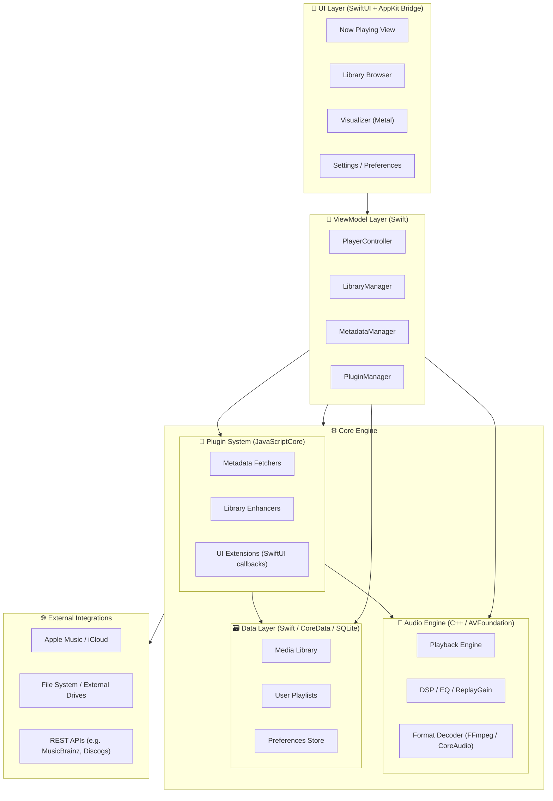
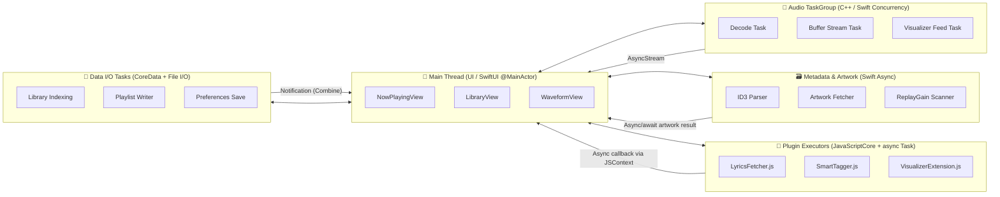

# Architecture - macOS Native Implementation

## Overview

Audientia is built as a native macOS Universal application (macOS 15+, Apple Silicon optimized) using SwiftUI, AppKit, C++, and Rust. The architecture follows a layered approach with clear separation of concerns and modern Swift concurrency patterns.

## Technology Stack

### UI Layer
- **SwiftUI**: Modern declarative UI framework
- **AppKit Bridge**: File dialogs, menus, drag-and-drop, native integrations
- **Metal**: Hardware-accelerated audio visualization

### ViewModel Layer
- **Swift Combine**: Reactive data flow
- **async/await**: Modern concurrency
- **@MainActor**: UI thread safety

### Audio Engine
- **C++**: Core audio processing
- **AVFoundation**: Apple's audio framework bridge
- **FFmpeg**: Format decoding (optional, for exotic formats)
- **CoreAudio**: Low-level audio I/O

### Metadata Engine
- **Rust or Swift**: Tag parsing and writing
- **Libraries**:
  - Rust: `id3`, `lofty`, `metaflac`
  - Swift: Custom parsers or Rust FFI

### Data Layer
- **CoreData**: Primary data store
- **SQLite**: Metadata cache and search index

### Plugin System
- **JavaScriptCore**: JavaScript runtime
- **Swift Bridge**: Native API exposure

## Architecture Diagram



## Concurrency and Async Flow



### Concurrency Patterns

#### Main Thread (@MainActor)
- All SwiftUI views run on `@MainActor`
- ViewModels marked with `@MainActor` for UI updates
- Synchronous UI updates only

#### Audio Processing (TaskGroup)
```swift
func startPlayback() async {
    await withTaskGroup(of: Void.self) { group in
        group.addTask { await self.decodeTask() }
        group.addTask { await self.bufferStreamTask() }
        group.addTask { await self.visualizerFeedTask() }
    }
}
```

#### Metadata Processing (Async/Await)
```swift
func loadMetadata(for track: Track) async throws -> TrackMetadata {
    async let id3 = parseID3(url: track.url)
    async let artwork = fetchArtwork(url: track.url)
    async let replayGain = calculateReplayGain(url: track.url)

    return try await TrackMetadata(
        tags: id3,
        artwork: artwork,
        replayGain: replayGain
    )
}
```

#### Plugin Execution (JavaScriptCore + Async)
```swift
func executePlugin(_ plugin: Plugin) async throws -> PluginResult {
    return try await withCheckedThrowingContinuation { continuation in
        plugin.context.evaluateScript(plugin.script) { result, error in
            if let error = error {
                continuation.resume(throwing: error)
            } else {
                continuation.resume(returning: result)
            }
        }
    }
}
```

#### Data I/O (Actor-based)
```swift
actor DataStore {
    private var library: [Track] = []

    func addTrack(_ track: Track) {
        library.append(track)
    }

    func search(_ query: String) -> [Track] {
        return library.filter { $0.matches(query) }
    }
}
```

## Component Breakdown

### UI Layer (SwiftUI + AppKit Bridge)

**Technology**: SwiftUI + AppKit
**Description**: Modern macOS "Liquid" interface with AppKit bridges for file dialogs, menus, and drag-and-drop.

**Components**:
- Now Playing View: Current track display, controls, artwork
- Library Browser: Track/album/artist views, search, filters
- Visualizer: Metal-powered audio visualization
- Settings: Preferences, plugin management, sync configuration

**AppKit Bridge**:
- File dialogs for library selection
- Menu bar integration
- Drag-and-drop for playlists
- System media controls

### ViewModel Layer (Swift)

**Technology**: Swift Combine / async-await
**Description**: Bridge between UI and core logic, managing playback state, progress, artwork, and other UI-related state.

**Components**:
- `PlayerController`: Playback state, queue management
- `LibraryManager`: Library operations, search, filtering
- `MetadataManager`: Tag editing, metadata operations
- `PluginManager`: Plugin lifecycle, execution

**Patterns**:
- MVVM architecture
- Combine publishers for reactive updates
- async/await for async operations
- `@MainActor` for thread safety

### Audio Engine (C++)

**Technology**: C++ with AVFoundation bridge
**Description**: Core audio decoding, playback, and DSP (equalizer, visualization feeds). Possible integration with JUCE or custom CoreAudio wrappers.

**Components**:
- Playback Engine: Core audio playback, queue management
- DSP Pipeline: EQ, ReplayGain, crossfade, effects
- Format Decoder: Audio format detection and decoding
- Visualizer Feed: FFT data for visualization

**Interfaces**:
- Swift → C++: Playback control, configuration
- C++ → Swift: Playback events, position updates, visualization data
- AsyncStream: Real-time audio frame streaming

### Data Layer (CoreData + SQLite)

**Technology**: CoreData / SQLite
**Description**: Stores music metadata, user ratings, playlists, and application preferences.

**CoreData Entities**:
- `Track`: Audio file metadata
- `Album`: Album information
- `Artist`: Artist information
- `Playlist`: User playlists
- `SmartPlaylist`: Rule-based playlists
- `PlaylistItem`: Playlist track references

**SQLite Usage**:
- Full-text search index
- Metadata cache for fast queries
- Tag history for undo/redo

**Concurrency**:
- CoreData contexts on background queues
- Actor-based access for thread safety
- Combine notifications for UI updates

### Plugin System (JavaScriptCore)

**Technology**: JavaScriptCore (Swift bridge)
**Description**: Extensions for new metadata sources, analytics, or custom UI behaviors in a safe, sandboxed environment.

**Plugin API**:
- Metadata fetching (MusicBrainz, Discogs, etc.)
- Library enhancement (auto-tagging, organization)
- UI extensions (custom views, actions)
- Event hooks (playback events, library changes)

**Security**:
- Sandboxed execution
- Limited API surface
- Permission system

**Async Integration**:
- JavaScriptCore callbacks bridged to Swift async/await
- Task-based execution for non-blocking plugin runs

### Metadata Engine (Rust or Swift)

**Technology**: Rust or Swift parser for tags/artwork
**Description**: Tag reading/writing, artwork extraction, metadata normalization.

**Features**:
- ID3v2, Vorbis Comments, MP4 tags
- Artwork extraction and embedding
- Metadata validation
- Batch operations

**Concurrency**:
- Async file I/O
- Parallel processing for batch operations
- Actor-based tag writing for thread safety

### Integrations

**Technology**: REST + CloudKit + FileManager
**Description**: External APIs for metadata, cloud sync, and file system access.

**Integrations**:
- MusicBrainz API: Metadata lookup
- Discogs API: Album information
- AcoustID: Track identification
- iCloud Drive: Library sync
- File System: Local library scanning

## Data Flow

### Playback Flow
1. User taps play → `PlayerController` (@MainActor)
2. `PlayerController` creates async task → `AudioEngine`
3. `AudioEngine` TaskGroup: decode, buffer, visualize
4. `AudioEngine` streams frames via `AsyncStream<AudioFrame>` → `PlayerController`
5. `PlayerController` updates state → UI via Combine (@MainActor)

### Library Scan Flow
1. User selects folder → UI (@MainActor)
2. UI requests scan → `LibraryManager`
3. `LibraryManager` creates async task → scans files
4. For each file: extract metadata → `MetadataEngine` (parallel async)
5. Store in database → `DataLayer` (actor-based)
6. Update UI → `LibraryManager` publishes updates via Combine (@MainActor)

### Tag Edit Flow
1. User edits tag → UI (@MainActor)
2. UI updates → `MetadataManager`
3. `MetadataManager` validates → writes to file via `MetadataEngine` (async)
4. Updates database → `DataLayer` (actor-based)
5. Notifies UI → Combine publisher (@MainActor)

## Folder Structure

```
Audientia/
├── AppKitBridge/        # SwiftUI <-> AppKit bridge components
│   ├── FileDialogs/
│   ├── MenuIntegration/
│   ├── DragAndDrop/
│   └── SystemMediaControls/
├── AudioCore/           # C++/Swift audio playback engine
│   ├── Engine/          # C++ playback engine
│   ├── DSP/             # DSP pipeline
│   ├── Decoder/         # Format decoders
│   └── Bridge/          # Swift-C++ bridge
├── MetadataEngine/      # Rust or Swift parser for tags/artwork
│   ├── Parsers/         # Tag parsers
│   ├── Writers/         # Tag writers
│   └── Artwork/         # Artwork handling
├── DataLayer/           # CoreData + SQLite backend
│   ├── CoreData/        # CoreData models and stack
│   ├── SQLite/          # SQLite cache and search
│   └── Migrations/      # Database migrations
├── UI/                  # SwiftUI-based front-end
│   ├── NowPlaying/
│   ├── Library/
│   ├── Playlists/
│   ├── Settings/
│   └── Visualizer/
├── PluginSystem/        # JavaScriptCore runtime
│   ├── Runtime/         # JavaScriptCore setup
│   ├── API/             # Plugin API
│   ├── Sandbox/         # Security sandbox
│   └── Examples/        # Example plugins
└── Shared/              # Models, view models, and utilities
    ├── Models/          # Data models
    ├── ViewModels/      # ViewModels
    ├── Utilities/       # Helper functions
    └── Extensions/      # Swift extensions
```

## Design Principles

### Separation of Concerns
- UI layer only handles presentation
- ViewModels handle UI logic and state
- Core engines handle business logic
- Data layer handles persistence

### Dependency Injection
- Dependencies passed via initializers
- Protocol-based abstractions
- Easy to mock for testing

### Reactive Programming
- Combine for data flow
- Publishers for state updates
- Minimal manual state synchronization

### Modern Concurrency
- async/await for async operations
- TaskGroup for parallel work
- Actor for shared mutable state
- @MainActor for UI thread safety

### Performance
- Lazy loading where possible
- Background processing for heavy operations
- Efficient data structures
- C++ for performance-critical audio processing

### Testability
- Protocol-based design
- Dependency injection
- Clear separation of concerns
- Comprehensive test coverage

## Future Considerations

### Scalability
- Efficient indexing for large libraries (100k+ tracks)
- Lazy loading of UI components
- Background processing queues

### Extensibility
- Plugin system for custom features
- Theme system for UI customization
- Custom metadata fields

### Integration
- Apple Music integration
- Spotify Connect (if API available)
- Last.fm scrobbling
- Subsonic-compatible server (future)
